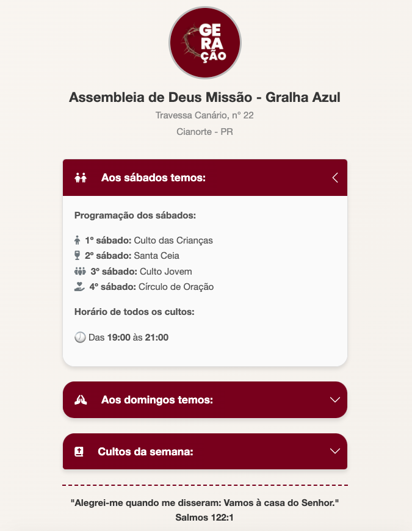

# 🕊️ Informações dos Cultos – Assembleia de Deus Missão – Gralha Azul

Este é um projeto simples feito com **HTML, CSS e Bootstrap** que apresenta de forma clara e organizada a programação de cultos da igreja Assembleia de Deus Missão – Gralha Azul, localizada em Cianorte - PR.

## 📌 Funcionalidades

- Exibição da **programação dos cultos** por dia da semana (sábado, domingo e durante a semana)
- Uso de **accordion interativo** para facilitar a navegação
- Layout moderno e responsivo, com **design agradável e leve**
- Ícones personalizados com Font Awesome para melhor experiência visual
- Frase bíblica inspiradora ao final da página

## 🛠️ Tecnologias Utilizadas

- HTML5
- CSS3
- [Bootstrap 5](https://getbootstrap.com/)
- [Font Awesome 6](https://fontawesome.com/)

## 📷 Preview



> **Endereço:** Travessa Canário, nº 22 – Cianorte/PR  
> **Frase:** *"Alegrei-me quando me disseram: Vamos à casa do Senhor."* – Salmos 122:1

## 🚀 Como testar o projeto

1. Clone este repositório:
   ```bash
   git clone https://github.com/LucasVentura52/projeto-igreja.git
   ```
2. Abra o arquivo `index.html` no navegador.

## 📁 Estrutura do Projeto

```
/
├── index.html
├── style.css
└── img/
    └── perfil.jpeg
```

## ✨ Créditos

Este projeto foi feito com carinho para compartilhar as informações dos cultos de forma acessível e moderna para todos os membros da igreja e visitantes.

Desenvolvido por: Lucas Ventura.
